# CRySPR Lattice-Free Coordination Number Study: Pilot Technical Report

**Date:** 2026-09-07 07:50:00 UTC  
**Protocol:** Lattice-free PyXtal sampling (`factor=1.3`, $M=10$ candidate draws/trial) + Oracle Coordination Number (CN) preselection (`CrystalNN` MAE) + 4-stage variable-cell CRySPR relaxation (`FrechetCellFilter`, ORB-v3)  
**Evaluated Cohort:** 25 high-DoF structures ($\text{Total DoF} \ge 6$) from the LeMat-Bulk benchmark cohort  
**Trial Budget:** 5 trials per structure ($N = 125$ variable-cell relaxations across 25 targets)  
**Apples-to-Apples Reference Benchmarks:** `base5` (36.0%), `fixed5` (20.0%), `relaxed_oracle5` (20.0%), `dense_cn` (16.0%), and `base10` (48.0%) on the exact same 25 targets.

---

## 1. Executive Summary

This pilot study directly tests the user's core hypothesis:
> **Hypothesis:** In the lattice-free baseline, PyXtal generates loose, unjammed unit cells ($V_{\text{init}} \approx 1.5 - 2.0\times V_{\text{target}}$) with $f=1.3$, enabling compressive annealing during relaxation (achieving 50.8% recovery). By drawing $M=10$ candidates with $f=1.3$ and ranking by `CrystalNN` MAE against Oracle ground truth, can we initialize inside the correct coordination basin while preserving the unconstrained cell volume that avoids explosive dilation?

### Headline Pilot Results (25 High-DoF Targets)

| Metric | Lattice-Free Baseline (`base5`, $f=1.3$) | Fixed-Cell Oracle (`fixed5`) | Relaxed-Cell Oracle (`relaxed_oracle5`, $f=1.0$) | Dense-Cell CN Oracle (`dense_cn5`, $f=1.0$) | **Lattice-Free CN-Guided** (`lf_cn5`, $f=1.3, M=10$) | Delta (LF-CN vs Baseline) | Lattice-Free Reference (`base10`, 10 trials) |
| :--- | :---: | :---: | :---: | :---: | :---: | :---: | :---: |
| **Material Recovery Rate** | **36.0%** (9/25) | 20.0% (5/25) | 20.0% (5/25) | 16.0% (4/25) | **8.0%** (2/25) | **-28.0% pts** | **48.0%** (12/25) |
| **Sampling Ceiling** | 36.0% (9/25) | 20.0% (5/25) | 20.0% (5/25) | 16.0% (4/25) | **8.0%** (2/25) | **-28.0% pts** | 52.0% (13/25) |
| **Missed Rate** | 64.0% (16/25) | 40.0% (10/25) | 76.0% (19/25) | 80.0% (20/25) | **84.0%** (21/25) | +20.0% pts | 48.0% (12/25) |
| **PyXtal Init Failures** | 0.0% (0/25) | 40.0% (10/25) | 4.0% (1/25) | 4.0% (1/25) | **4.0%** (1/25) | +4.0% pts | 0.0% (0/25) |
| **Lower Energy Alt.** | 0.0% (0/25) | 0.0% (0/25) | 0.0% (0/25) | 0.0% (0/25) | **4.0%** (1/25) | +4.0% pts | 0.0% (0/25) |

---

## 2. Core Scientific Finding: The "Goodhart's Law" of Coordination Preselection

The pilot reveals a decisive, counter-intuitive result: **combining CN preselection with loose, lattice-free sampling causes material recovery to collapse from 36.0% down to 8.0%.**

Analyzing the per-structure trajectories uncovers the precise physical mechanism behind this failure:

```mermaid
flowchart TD
    subgraph Baseline ["Lattice-Free Baseline (f=1.3, Pure Random)"]
        B1["Uniform Spatial Distribution in Loose Box (V ~ 1.7x)"] --> B2["Pairwise Distances Uniformly Dilated (~1.19x)"]
        B2 --> B3["ORB-v3 Compressive Annealing (FrechetCellFilter)"]
        B3 --> B4["Isotropic Contraction to Equilibrium (V_final/V_tgt ~ 1.34x)"]
        B4 --> B5["High Ground-State Recovery (36.0% at 5 trials, 48.0% at 10 trials)"]
    end

    subgraph LFCN ["Lattice-Free CN-Guided (f=1.3, M=10 Preselected)"]
        C1["Loose Unit Cell (V ~ 1.7x) with Chemical Bonds Unformed"] --> C2["Preselection seeks high CN matching dense crystal"]
        C2 --> C3["Adverse Selection: Selects candidates with artificial atom clumping / giant voids"]
        C3 --> C4["ORB-v3 Variable-Cell Relaxation starts on dense clusters"]
        C4 --> C5["Violent Repulsive Pressure explodes cell outward (V_final/V_tgt ~ 1.79x - 3.5x)"]
        C5 --> C6["Severe Recovery Collapse (8.0% recovery, 84.0% missed)"]
    end
```

### 1. The Physics of Loose Cells ($V_{\text{init}} \approx 1.7\times V_{\text{target}}$)
In an unrelaxed, expanded unit cell, true chemical bonds have not yet formed. Pairwise distances are dilated by $\sqrt[3]{1.7} \approx 1.19\times$ (19% longer than equilibrium). Under these dilated conditions, atoms should naturally have low apparent Voronoi coordination.

### 2. Adverse Selection by CN Error Optimization
When $M=10$ random candidates are generated in an expanded box and scored against the ground-truth coordination numbers (e.g. target $\text{CN} = 8 - 12$):
- A uniformly distributed candidate has low apparent coordination ($\text{CN} \approx 2 - 4$), incurring a high CN error penalty.
- To achieve a high apparent coordination number in an expanded cell, a candidate must have **atoms artificially clumped together**, leaving large empty vacuums elsewhere in the unit cell.
- Consequently, CN preselection systematically rejects uniform, unjammed candidates and actively selects **severely clustered, asymmetric, and internally strained configurations**.

### 3. Destruction of Compressive Annealing
- **Baseline Dynamics**: The baseline succeeds because pure random sampling maintains spatial uniformity. During variable-cell BFGS relaxation with `FrechetCellFilter`, uniform attractive forces gently draw the cell together, contracting median volume from $1.683\times \to 1.343\times$.
- **LF-CN Dynamics**: In the CN-preselected candidates, the artificial atom clusters exert fierce short-range repulsive forces. Instead of contracting, the cell blows apart during variable-cell relaxation, expanding the median volume to **$1.788\times$** (with extreme cases expanding to $3.52\times$ ground truth volume).

---

## 3. Case Study: Structure 22 (`CdRb2Sn`, Spacegroup 194, 6 DoF)

Structure 22 provides a definitive demonstration of this adverse selection effect:

- **Lattice-Free Baseline (`base5`)**: **5 out of 5 trials recovered the ground state (100% match rate)**.
  - Initial volumes: $1.72\times - 3.13\times$.
  - Final volumes: $1.992\times - 1.999\times$.
  - Pure random initialization preserved the symmetry of Wyckoff positions and smoothly compressed into the true hexagonal ground state.

- **Lattice-Free CN-Guided (`lf_cn5`)**: **0 out of 5 trials recovered (0% match rate)**.
  - Target CN: $\text{Sn} = 10.0, \text{Rb} = 6.0, \text{Cd} = 2.0$.
  - In candidate selection, unrelaxed uniform candidates had $\text{Sn} \text{ CN} \approx 3 - 4$.
  - CN filtering selected candidates with unnatural Sn-Rb proximity to force apparent CN up to 6.
  - During relaxation, this unnatural proximity created huge asymmetric stress, blowing the cell apart to $V_{\text{final}} / V_{\text{target}} = \mathbf{3.517\times}$ in Trial 1 and $\mathbf{3.519\times}$ in Trial 3.

---

## 4. Per-Structure Recovery Breakdown (25 Targets)

| Struct Idx | Formula | Spacegroup | Total DoF | Pos DoF | Baseline (`base5`) | Dense CN (`dense_cn`) | **LF-CN** (`lf_cn`) | Verdict | $\Delta E$ (eV/atom) |
| :---: | :--- | :---: | :---: | :---: | :---: | :---: | :---: | :---: | :---: |
| 0 | HoO8P2Rb3 | 164 | 7 | 5 | **True** | False | False | missed | +0.6188 |
| 1 | C15Fe5Sm12 | 180 | 12 | 10 | False | False | False | missed | +0.1652 |
| 2 | MgNiP | 189 | 9 | 5 | **True** | False | False | missed | +0.0689 |
| 3 | CuS2Y | 14 | 11 | 8 | False | False | False | missed | +0.0116 |
| 4 | BaH4Rh | 63 | 8 | 6 | False | False | False | missed | +0.0193 |
| 5 | Ac3Cu2Ir7 | 166 | 6 | 4 | False | False | False | missed | +0.1956 |
| 6 | GdPdZn | 62 | 9 | 5 | False | False | **True** | **recovered** | +0.0001 |
| 7 | AsC3Se2Th6 | 62 | 14 | 10 | False | False | False | missed | +0.1144 |
| 8 | AuGdZn | 189 | 9 | 5 | **True** | False | False | missed | +0.0156 |
| 9 | C2I9La5 | 14 | 51 | 48 | False | False | False | missed | +0.1692 |
| 10 | InO13Pb4Sb3 | 12 | 17 | 13 | False | False | False | missed | +0.1619 |
| 11 | AuHoO3 | 62 | 11 | 7 | False | False | False | missed | +0.0984 |
| 12 | DyPmY2 | 194 | 12 | 10 | False | **True** | **True** | **recovered** | +0.0000 |
| 13 | Mn2NdO5 | 62 | 16 | 12 | **True** | False | False | missed | +0.2442 |
| 14 | In15Pu4Sc | 139 | 8 | 6 | **True** | False | False | missed | +0.1484 |
| 15 | PS4Sb | 2 | 114 | 108 | False | False | False | generation_failed | N/A |
| 16 | F4NpO2Tl2 | 64 | 11 | 7 | False | False | False | missed | +0.0454 |
| 17 | InIr2Pr2 | 139 | 11 | 9 | False | False | False | missed | +0.0160 |
| 18 | Al3CuDy2Ge2Ho | 65 | 12 | 8 | **True** | False | False | missed | +0.1326 |
| 19 | FeN4PrPu2 | 123 | 10 | 8 | **True** | False | False | missed | +0.1873 |
| 20 | CuNbPt2 | 166 | 7 | 5 | **True** | **True** | False | missed | +0.0527 |
| 21 | Ce4S22Tm11 | 62 | 40 | 36 | False | False | False | missed | +0.1678 |
| 22 | CdRb2Sn | 194 | 6 | 4 | **True** | **True** | False | missed | +0.0526 |
| 23 | NaNb3O8 | 12 | 15 | 11 | False | False | False | missed | +0.0337 |
| 24 | C2ClPm2 | 166 | 11 | 9 | False | **True** | False | lower_energy_alt | -0.0174 |

---

## 5. Strategic Conclusion & Recommendations

1. **Do not run the full 400 cohort on Lattice-Free CN preselection**:
   The pilot establishes conclusively that evaluating unrelaxed Voronoi coordination numbers in loose unit cells ($f=1.3$) suffers from severe adverse selection, cutting recovery from 36.0% down to 8.0%.

2. **Why Coordination Number is inherently a post-relaxation / equilibrium descriptor**:
   Coordination numbers describe chemical bonding polyhedra that exist *after* atoms relax into energetic equilibrium. Scoring unrelaxed, random atomic coordinates with Voronoi geometry penalizes spatially uniform states and rewards artificially clumped configurations.

3. **What parameters *can* WyFormer predict to guide PyXtal?**:
   Instead of coordination numbers (which are sensitive to volume and unrelaxed clustering), the parameters that WyFormer can predict that directly and robustly guide PyXtal without distortion are:
   - **Target Density / Packing Fraction ($\rho$ or $V_{\text{target}}$)**: Setting a gentle, unjammed target volume ($1.3 - 1.4\times$) avoids extreme dilatations while avoiding jamming.
   - **Element-Specific Minimum Tolerance Radii ($r_i$)**: Tailoring `Tol_matrix` per element (rather than a global scalar `factor`) prevents anion-anion overlap without over-constraining large cations.
   - **Wyckoff Multiplicity Sub-selection**: When multiple equivalent Wyckoff sets exist, selecting the specific Wyckoff letters that minimize packing clash.
