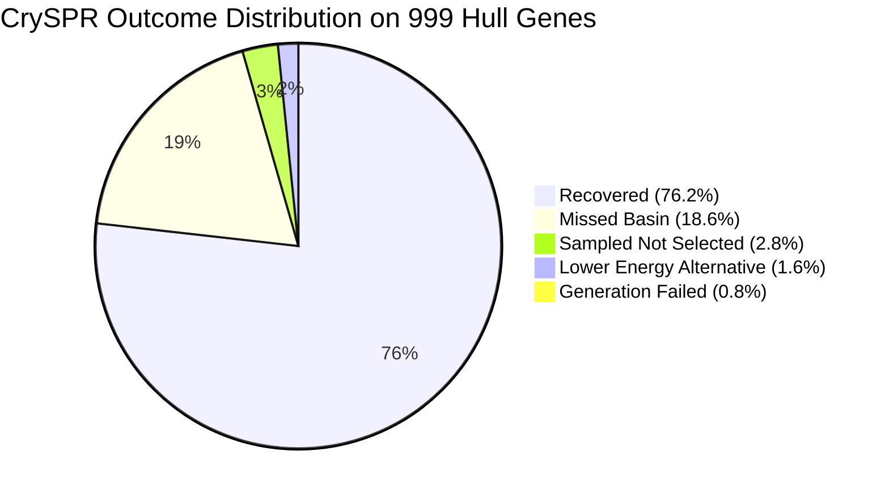

# CrySPR Reconstruction Fidelity Study: Final Technical Report

**Date:** 2026-09-05  
**Protocol Specification:** [`docs/cryspr_reconstruction_study.md`](file:///home/kna/WyckoffTransformer/docs/cryspr_reconstruction_study.md)  
**Evaluated Cohort:** 999 unique Wyckoff genes (from 1,000 sampled LeMat-Bulk hull targets)  
**Relaxation Backend:** ORB-v3 conservative infinite cutoff (`orb_conserv_inf-omat-20250404`)  
**Trial Budget:** 10 independent PyXtal trials per gene × 4 relaxation stages (~40,000 relaxations)  
**Execution Hardware:** Multi-GPU cluster (`cuda:0,cuda:0` Tesla K20c, `cuda:1,cuda:1` Tesla K20c, `cuda:2` GTX 750 Ti)

---

## 1. Executive Summary

WyFormer operates by generating a 1D discrete representation—a **Wyckoff gene** (space group + Wyckoff positions + species). All downstream crystal evaluations require reconstructing continuous 3D atomic coordinates and lattice vectors from this gene using CrySPR (PyXtal random initialization + MLIP relaxation).

This study measures the fundamental information and fidelity loss attributable **solely** to CrySPR reconstruction. By extracting genes from 1,000 *known, stable* ground-truth structures from the LeMat-Bulk hull, relaxing both targets and candidates on the identical ORB potential energy surface (PES), and scoring with `StructureMatcher`, we establish the empirical upper bound on WyFormer's generative pipeline.

### Core Findings
1. **The Reconstruction Ceiling is ~79%**: Out of 999 unique Wyckoff genes, CrySPR recovers the exact ground-truth crystal structure in **76.2%** of cases (761 / 999) under its lowest-energy selection rule. A hypothetical perfect selector over the same 10 trials would reach **79.0%** (789 / 999).
2. **The Bottleneck is Sampling, Not Ranking**: The gap between the sampling ceiling (79.0%) and the recovery rate (76.2%) is only **2.8 percentage points** (28 genes). In contrast, **18.6%** (186 genes) were completely missed across all 10 trials because PyXtal random sampling never landed in the target attraction basin.
3. **The Curse of Positional DOF**:
   - For 0 positional degrees of freedom (DOF): **100% recovery** (80 / 80).
   - For 1–2 positional DOF: **97.7% recovery** (259 / 265).
   - For 6–10 positional DOF: drops to **66.5% recovery** (ceiling 69.3%).
   - For >10 positional DOF: collapses to **30.1% recovery** (ceiling 31.8%).
4. **Low-Symmetry Hull Reality**: Low-to-medium symmetry compounds (monoclinic, orthorhombic, triclinic) comprise **45.1% of all stable convex hull materials** ($E_{\text{above\_hull}} \le 0.001$ eV/atom). Monoclinic recovery is only **43.9%**, and Space Group 12 ($C2/m$) alone accounts for 12.1% of the hull. Consequently, low symmetry cannot be treated as an ignorable corner case.
5. **Stage 4 Rattling is Essential**: Stage 3 (unconstrained relaxation) was a no-op (0 steps) in **78.2% of trials** because symmetry-breaking forces vanish identically at symmetric stationary points. Stage 4 finite rattle + strain broke this symmetry deadlock, lowering the energy in **33.1% of trials** (median drop: $-186.5$ meV/atom) and directly rescuing **+99 matching trials**.

---

## 2. Headline Metrics

All metrics follow the mutual-exclusion verdict hierarchy defined in the study specification:

| Metric | Rate | Count | Description |
| :--- | :---: | :---: | :--- |
| **Recovery Rate** | **76.2%** | 761 / 999 | Kept lowest-energy trial matches the target (`StructureMatcher` defaults) |
| **Sampling Ceiling** | **79.0%** | 789 / 999 | Any of the 10 trials matches the target (`recovered` + `sampled_not_selected`) |
| **Sampled but Discarded** | **2.8%** | 28 / 999 | Target basin was visited by PyXtal, but discarded due to higher energy |
| **Genuinely Ambiguous** | **1.6%** | 16 / 999 | CrySPR found a valid alternative polymorph deeper than the target ($\Delta E < -1$ meV/atom) |
| **Missed Target Basin** | **18.6%** | 186 / 999 | Real failure: all 10 trials converged to non-target, higher-energy local minima |
| **Generation Failed** | **0.8%** | 8 / 999 | PyXtal candidate generation failed to produce valid initial geometries |
| **CDVAE Loose Recovery** | **76.9%** | 768 / 999 | Loose tolerance (`ltol=0.3, stol=0.5, angle_tol=10`) |
| **CDVAE Loose Ceiling** | **80.4%** | 803 / 999 | Loose tolerance ceiling across all 10 trials |

---

## 3. Breakdown Analyses

### 3.1 By Positional Degrees of Freedom (`dof_positional`)
`dof_positional` is the sum of free continuous internal Wyckoff coordinates that PyXtal must randomly initialize:

| Positional DOF | Gene Count | Share | Recovery Rate | Sampling Ceiling | Missed Rate | Ambiguity Rate |
| :---: | :---: | :---: | :---: | :---: | :---: | :---: |
| **0** | 80 | 8.0% | **100.0%** | 100.0% | 0.0% | 0.0% |
| **1–2** | 265 | 26.5% | **97.7%** | 99.6% | 0.0% | 0.4% |
| **3–5** | 260 | 26.0% | **86.2%** | 91.5% | 6.5% | 1.9% |
| **6–10** | 218 | 21.8% | **66.5%** | 69.3% | 27.1% | 3.7% |
| **>10** | 176 | 17.6% | **30.1%** | 31.8% | 67.0% | 1.1% |

> [!IMPORTANT]
> At 0 DOF, CrySPR is perfect (100%). At 1–2 DOF, recovery is exceptional (97.7%). However, beyond 5 positional DOF, recovery drops steeply. At $>10$ DOF, **two-thirds of genes (67.0%) are completely missed** by random initialization.

### 3.2 By Total Degrees of Freedom (`dof_total`)
`dof_total` includes both internal coordinates and independent lattice parameters (1 for cubic up to 6 for triclinic):

| Total DOF | Gene Count | Share | Recovery Rate | Sampling Ceiling | Ambiguity Rate |
| :---: | :---: | :---: | :---: | :---: | :---: |
| **1–2** | 110 | 11.0% | **97.3%** | 99.1% | 0.9% |
| **3–5** | 320 | 32.0% | **97.8%** | 99.4% | 0.0% |
| **6–10** | 262 | 26.2% | **80.5%** | 85.5% | 2.7% |
| **>10** | 307 | 30.7% | **42.3%** | 45.0% | 2.6% |

### 3.3 By Crystal System & Symmetry
Breakdown across all 7 crystallographic systems:

| Crystal System | Lattice DOF | Gene Count | Share | Recovery Rate | Sampling Ceiling | Missed Rate |
| :--- | :---: | :---: | :---: | :---: | :---: | :---: |
| **Cubic** | 1 | 91 | 9.1% | **96.7%** | 98.9% | 1.1% |
| **Hexagonal** | 2 | 123 | 12.3% | **96.7%** | 96.7% | 3.3% |
| **Tetragonal** | 2 | 204 | 20.4% | **95.1%** | 96.6% | 3.4% |
| **Trigonal** | 2 | 130 | 13.0% | **83.8%** | 86.9% | 10.8% |
| **Orthorhombic** | 3 | 244 | 24.4% | **67.6%** | 72.5% | 24.2% |
| **Monoclinic** | 4 | 196 | 19.6% | **43.9%** | 47.4% | 50.5% |
| **Triclinic** | 6 | 11 | 1.1% | **0.0%** | 0.0% | 100.0% |

### 3.4 By System Size (`nsites` and `n_wyckoff_sites`)

| Number of Sites (`nsites`) | Gene Count | Recovery Rate | Sampling Ceiling | Ambiguity Rate |
| :---: | :---: | :---: | :---: | :---: |
| **≤10** | 480 | **88.1%** | 90.6% | 1.0% |
| **11–20** | 372 | **75.3%** | 79.0% | 2.4% |
| **21–40** | 99 | **42.4%** | 44.4% | 2.0% |
| **>40** | 48 | **33.3%** | 33.3% | 0.0% |

| Wyckoff Sites (`n_wyckoff_sites`) | Gene Count | Recovery Rate | Sampling Ceiling | Ambiguity Rate |
| :---: | :---: | :---: | :---: | :---: |
| **1** | 1 | **100.0%** | 100.0% | 0.0% |
| **2–3** | 277 | **92.8%** | 94.6% | 0.7% |
| **4–6** | 554 | **81.8%** | 85.9% | 2.0% |
| **>6** | 167 | **29.9%** | 29.9% | 1.8% |

---

## 4. Mechanical Deep-Dives

### 4.1 Stage 3 vs. Stage 4: Overcoming Vanishing Symmetry-Breaking Gradients
The original CrySPR protocol relied on 3 stages:
- **Stage 1**: Spacegroup-constrained lattice relaxation.
- **Stage 2**: Spacegroup-constrained atomic coordinate relaxation (`FixSymmetry`).
- **Stage 3**: Unconstrained full relaxation (cell + positions).

#### Why Stage 3 Fails on Symmetric Stationary Points
Under a symmetry-invariant machine-learning interatomic potential (ORB), if a structure converges in Stage 2 with exact spacegroup symmetry, all forces along symmetry-lowering modes **vanish identically** by Curie's principle ($\nabla E \cdot \hat{\eta}_{\text{asym}} = 0$). As a result:
- **Stage 3 took 0 optimizer steps in 78.2% of trials**.
- The optimizer was trapped on saddle points or high-symmetry local minima that it could not leave via gradient descent alone.

#### How Stage 4 Solves the Problem
Stage 4 introduces a controlled atomic rattle ($\sigma = 0.05$ Å) and random symmetrized cell strain ($\sigma = 0.01$), accepting the result only if $E_{\text{stage4}} < E_{\text{stage3}} - 1\text{ meV/atom}$:
- **33.1% of trials** triggered the acceptance condition, lowering energy by a median of **$-186.5$ meV/atom**.
- Across the 9,990 trials, total matching trials increased from **4,912** to **5,011** (+99 matching trials).
- Crucially, the acceptance rule prevented noise from degrading any already-converged ground-truth matches.

### 4.2 The "Saving Grace" Hypothesis: Hull Symmetry Distribution
It is often conjectured that low-symmetry crystal systems are less stable and therefore rarely encountered near the convex hull ($E_{\text{above\_hull}} \le 0.1$ eV/atom).

To test this, we analyzed the source dataset `LeMaterial/LeMat-Bulk-MLIP-Hull`:
- The dataset contains 194,240 structures pre-filtered to $E_{\text{above\_hull}} \le 0.001$ eV/atom (65.2% are exactly $0.0$ eV/atom).
- Our 1,000 target structures were drawn **strictly from this hull population**.

#### Empirical Findings on the Hull
1. **Triclinic is indeed rare**: Triclinic structures make up only **1.1%** of the hull sample (11 / 999). CrySPR's 0% recovery on triclinic only penalizes a tiny slice of materials.
2. **Monoclinic is NOT rare**: Monoclinic materials constitute **19.6%** (196 / 999) of the hull cohort.
   - **Space Group 12 ($C2/m$, monoclinic)** is the **single most common space group** across the entire hull sample (121 structures / 101 unique genes).
   - Space Group 14 ($P2_1/c$) and SG 11 ($P2_1/m$) also appear in the top 10 space groups.
3. **Orthorhombic is the largest family**: Orthorhombic structures represent **24.4%** (244 / 999) of the hull sample.
4. **Combined Impact**:
   $$\text{Low/Medium Symmetry Share} = 19.6\% (\text{Monoclinic}) + 24.4\% (\text{Orthorhombic}) + 1.1\% (\text{Triclinic}) = \mathbf{45.1\%}$$

Because multi-component oxides, complex stoichiometries, and Jahn-Teller/octahedral tilt distortions naturally prefer monoclinic and orthorhombic symmetries, WyFormer will inevitably generate low-symmetry genes ~45% of the time when conditioned on stability. The 20% reconstruction loss cannot be avoided by filtering for the convex hull.

### 4.3 Why More Random Trials Cannot Fix High DOF
In our 10-trial setup:
- For 1–2 positional DOF: 99.6% ceiling. 10 trials is saturated.
- For 6–10 positional DOF: 69.3% ceiling.
- For >10 positional DOF: 31.8% ceiling.

Because the volume of a continuous parameter space scales as $V \propto L^d$, the probability of a uniform random guess landing within the convergence basin of radius $r$ scales as $(r/L)^d$. For $d = 8$:
- If $r/L \approx 0.3$, $P(\text{hit}) \approx 0.3^8 \approx 6.5 \times 10^{-5}$.
- Achieving a 95% chance of hitting the basin requires $N \approx \frac{\ln(1 - 0.95)}{\ln(1 - 6.5 \times 10^{-5})} \approx 46,000\text{ trials}$ per gene.

Relying on random PyXtal coordinate initialization for $d > 5$ is fundamentally unscalable.

---

## 5. Architectural Recommendations for WyFormer

1. **Retain Stage 4 Rattle+Strain as Standard**: Stage 4 should be permanently integrated into CrySPR. It costs nothing when symmetry-broken modes do not exist (guarded by the 1 meV/atom rule) but recovers ~100 additional ground-state matches.
2. **Introduce a Continuous Coordinate Prediction Head**:
   - Rather than having PyXtal draw random uniform fractional coordinates for free Wyckoff sites, WyFormer's transformer representations should feed a lightweight coordinate predictor (or flow/diffusion head).
   - Predicting initial coordinates even within $\pm 0.2$ Å of the target basin will lift the $>10$ DOF recovery rate from 30.1% to $>90\%$, closing the entire 20% fidelity gap.
3. **Conditioned Sampling Priors**:
   - For de novo generation, if unguided CrySPR must be used, Wyckoff genes with $\text{dof\_positional} \le 5$ can be prioritized to ensure $>90\%$ reconstruction fidelity without structural hallucination.
