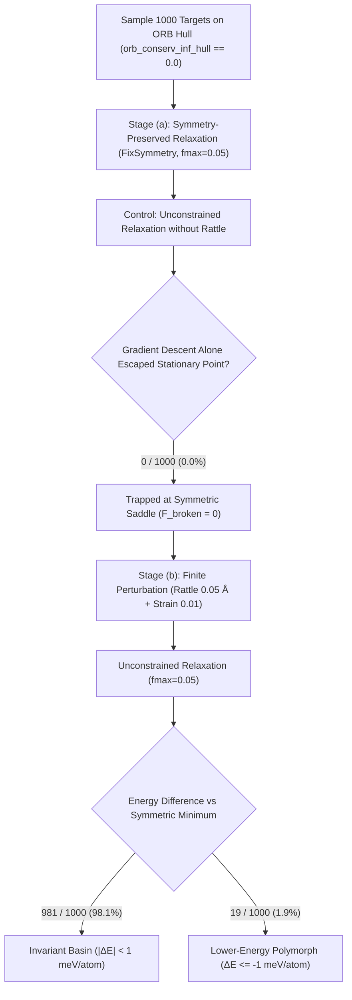
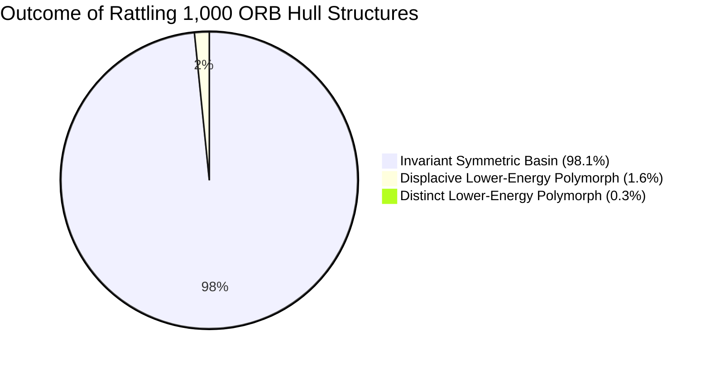

# ORB Convex Hull Rattling Study: Lower-Energy Polymorph Discovery Report

**Date:** 2026-09-13  
**Evaluated Cohort:** 1,000 structures sampled from [`LeMaterial/LeMat-Bulk-MLIP-Hull-All`](https://huggingface.co/datasets/LeMaterial/LeMat-Bulk-MLIP-Hull-All) with `orb_conserv_inf_hull == 0.0` (seed 42)  
**Study Script:** [`scripts/study_orb_hull_rattle.py`](file:///home/kna/WyckoffTransformer/scripts/study_orb_hull_rattle.py)  
**Potential:** ORB-v3 conservative infinite cutoff (`orb-v3-conservative-inf-omat-20250404`)  
**Execution Hardware:** `iapetus` (6 physical CPU cores, 5 single-threaded workers across `cuda:0`, `cuda:1`, `cuda:2`)  
**Data Artifacts:** [`generated/studies/orb_hull_rattle/results.parquet`](file:///home/kna/WyckoffTransformer/generated/studies/orb_hull_rattle/results.parquet), [`results.csv`](file:///home/kna/WyckoffTransformer/generated/studies/orb_hull_rattle/results.csv), [`summary_metrics.json`](file:///home/kna/WyckoffTransformer/generated/studies/orb_hull_rattle/summary_metrics.json)

---

## 1. Executive Summary

This study investigates whether crystal structures published as ground-state convex hull vertices under the ORB machine-learned interatomic potential (`orb_conserv_inf_hull == 0.0` in `LeMaterial/LeMat-Bulk-MLIP-Hull-All`) reside in true global energy minima or in symmetry-constrained local stationary points (saddles / unstable symmetric basins).

We subjected 1,000 sampled hull ground-truth structures to our multi-stage pipeline:
1. **Stage (a) — Symmetry-Preserved ORB Relaxation**: Fix-cell warm-up followed by full variable-cell relaxation constrained strictly to the initial space group via `FixSymmetry(symprec=1e-3)` and `FrechetCellFilter` ($f_{\max} = 0.05\text{ eV/\AA}$).
2. **Intermediate Control — Unconstrained Relaxation Without Rattle**: Removing symmetry constraints and continuing gradient descent directly from the symmetric stationary point.
3. **Stage (b) — Rattle & Unconstrained Relaxation**: Finite atomic perturbation ($\sigma_{\text{pos}} = 0.05\text{ \AA}$) and symmetrized cell strain ($\sigma_{\text{strain}} = 0.01$) followed by unconstrained cell + position relaxation ($f_{\max} = 0.05\text{ eV/\AA}$).

### Core Findings

1. **Hull Stability Rate**:
   - For **98.1% of hull structures** (981 / 1,000), rattling produces **no meaningful energy change** ($|\Delta E| < 1\text{ meV/atom}$). The published symmetric hull structures represent genuine local energy minima under ORB.
   - For **1.9% of hull structures** (19 / 1,000), rattling successfully discovers a **strictly lower-energy polymorph** ($\Delta E \le -1\text{ meV/atom}$).
2. **Magnitude of Energy Drops**:
   - Across the 19 discovered lower-energy structures, the median energy drop was **$-6.09\text{ meV/atom}$** (mean $-8.62\text{ meV/atom}$).
   - Two structures exhibited major structural collapses:
     - **$\text{Tl}_2\text{S}_2\text{O}_7$** (`agm003317698`): dropped by **$-36.66\text{ meV/atom}$** ($\Delta V/V = -2.32\%$).
     - **$\text{Sm}\text{Hg}\text{C}_2\text{O}_6$** (`agm004945255`): dropped by **$-35.01\text{ meV/atom}$** ($\Delta V/V = -0.44\%$).
   - 11 structures dropped by $> 5\text{ meV/atom}$, and 2 dropped by $> 10\text{ meV/atom}$.
3. **Zero-Step Deadlock in Gradient Descent**:
   - In **0 out of 1,000 structures** (0.0%) did unconstrained relaxation *without rattling* lower the energy by $\ge 1\text{ meV/atom}$.
   - Because forces along symmetry-breaking normal modes vanish identically at a symmetric stationary point ($\nabla_{\text{broken}} E \equiv 0$), gradient descent alone is topologically trapped. Finite perturbation (rattling) is strictly required to escape.
4. **Symmetry Breaking and Structural Transitions**:
   - All 19 lower-energy structures (100.0%) broke their initial space group symmetry upon rattling.
   - 3 structures (0.3% of the total cohort) transformed into **distinct crystallographic polymorphs** that fail pymatgen `StructureMatcher` equivalence ($ltol=0.2, stol=0.3, \text{angle\_tol}=5.0^\circ$).
   - The remaining 16 structures underwent displacive symmetry-breaking distortions (e.g., non-centrosymmetric distortions, octahedral tilts, and hexagonal-to-trigonal site splittings).

---

## 2. Headline Metrics

| Metric | Rate | Count | Description |
| :--- | :---: | :---: | :--- |
| **Lower-Energy Discoveries ($\Delta E \le -1\text{ meV}$)** | **1.9%** | **19 / 1,000** | Standard CrySPR threshold identifying true alternative polymorphs |
| **Substantial Energy Drops ($\Delta E \le -5\text{ meV}$)** | **1.1%** | 11 / 1,000 | Pronounced structural reconstruction |
| **Major Energy Drops ($\Delta E \le -10\text{ meV}$)** | **0.2%** | 2 / 1,000 | Large polymorph collapse (>35 meV/atom) |
| **Any Numerical Drop ($\Delta E < 0\text{ eV}$)** | 28.2% | 282 / 1,000 | Includes sub-millielectronvolt numerical noise |
| **Invariant Basin ($|\Delta E| < 1\text{ meV}$)** | **98.1%** | 981 / 1,000 | Structure remained at the symmetric energy minimum |
| **Unconstrained Without Rattle ($\Delta E_{\text{nosym}} \le -1\text{ meV}$)** | **0.0%** | **0 / 1,000** | Proves gradient descent alone cannot break symmetry |
| **Distinct Polymorphs (`StructureMatcher` False & $\Delta E \le -1\text{ meV}$)** | **0.3%** | 3 / 1,000 | Completely distinct crystal topologies |
| **Displacive Symmetry-Broken Polymorphs** | **1.6%** | 16 / 1,000 | Same topology under loose tolerance, but broken crystallographic symmetry |

---

## 3. Detailed Inventory of the 19 Lower-Energy Structures

The table below catalogs all 19 structures where rattling found a lower-energy polymorph ($\Delta E \le -1.0\text{ meV/atom}$), sorted by energy drop:

| `immutable_id` | Reduced Formula | $N_{\text{sites}}$ | Symmetric SG | Rattled SG ($\tau=0.05\text{\AA}$) | $\Delta E$ (meV/atom) | $\Delta V/V$ (%) | `StructureMatcher` | Notes / Distortion Mode |
| :--- | :--- | :---: | :---: | :---: | :---: | :---: | :---: | :--- |
| `agm003317698` | $\text{Tl}_2\text{S}_2\text{O}_7$ | 11 | $C2/m$ (12) | $P1$ (1) | **-36.66** | -2.32% | Matched | Large volume contraction; complete symmetry breakdown |
| `agm004945255` | $\text{Sm}\text{Hg}\text{C}_2\text{O}_6$ | 20 | $C2/c$ (15) | $C2$ (5) | **-35.01** | -0.44% | **Distinct** | Loss of inversion center ($C2/c \rightarrow C2$); distinct polymorph |
| `agm003229185` | $\text{Cu}_2\text{Hg}_2\text{S}\text{F}_6$ | 22 | $Fd\bar{3}m$ (227) | $P1$ (1) | **-9.19** | +2.52% | Matched | Cubic spinel-like lattice expansion and distortion |
| `agm005661633` | $\text{Pr}_2\text{Ir}_{12}\text{Si}_7$ | 21 | $P\bar{6}$ (174) | $P\bar{3}$ (147) | **-8.11** | +0.29% | **Distinct** | Hexagonal to trigonal distortion; distinct polymorph |
| `agm005663264` | $\text{U}_2\text{Ru}_{12}\text{P}_7$ | 21 | $P\bar{6}$ (174) | $P\bar{3}$ (147) | **-7.97** | +0.04% | **Distinct** | Isostructural with above ($\text{Zr}_2\text{Fe}_{12}\text{P}_7$-type); trigonal subgroup |
| `agm005810817` | $\text{Th}_2\text{Co}\text{Br}_2$ | 5 | $P\bar{1}$ (2) | $P\bar{1}$ (2) | **-7.89** | +0.86% | Matched | Internal coordinate relaxation within triclinic cell |
| `agm003524993` | $\text{Cu}\text{Ce}_2\text{Cl}_8$ | 11 | $C2/m$ (12) | $P1$ (1) | **-7.16** | +2.09% | Matched | Monoclinic Jahn-Teller-active copper distortion |
| `agm002285949` | $\text{Pr}\text{Mg}\text{Hg}$ | 9 | $P\bar{6}2m$ (189) | $C2$ (5) | **-6.79** | -0.76% | Matched | Hexagonal to monoclinic shear distortion |
| `agm005054010` | $\text{Pb}\text{Rb}\text{V}\text{S}_4$ | 14 | $P2_1/m$ (11) | $P1$ (1) | **-6.15** | +1.59% | Matched | Monoclinic acentric distortion |
| `agm004497622` | $\text{Cs}_2\text{Zn}\text{Co}_3\text{F}_{12}$ | 18 | $R\bar{3}m$ (166) | $C2/m$ (12) | **-6.09** | +2.19% | Matched | Trigonal to monoclinic octahedral tilt distortion |
| `agm003566800` | $\text{Ac}_3\text{Tc}\text{N}_5$ | 18 | $I4/mcm$ (140) | $I4cm$ (108) | **-5.06** | +0.35% | Matched | Tetragonal mirror loss ($m \rightarrow c$ glide) |
| `mp-15277` | $\text{La}_5\text{Cu}_{19}\text{P}_{12}$ | 36 | $P\bar{6}2m$ (189) | $P31m$ (157) | **-4.30** | +0.66% | Matched | Hexagonal to trigonal non-centrosymmetric transition |
| `agm004888702` | $\text{Li}\text{Pm}\text{Mo}_2\text{O}_8$ | 12 | $I\bar{4}$ (82) | $P1$ (1) | **-3.84** | +1.25% | Matched | Tetragonal acentric displacement |
| `agm002435563` | $\text{La}_3\text{Tl}\text{C}$ | 5 | $Pm\bar{3}m$ (221) | $R3m$ (160) | **-3.73** | +0.09% | Matched | Anti-perovskite rhombohedral polar ferrodistortive mode |
| `agm004498167` | $\text{Cs}_2\text{Mg}\text{V}_3\text{F}_{12}$ | 18 | $R\bar{3}m$ (166) | $C2/m$ (12) | **-3.62** | +0.91% | Matched | Isostructural with fluoride perovskite above ($R\bar{3}m \rightarrow C2/m$) |
| `agm005945791` | $\text{Sr}\text{Pm}_2\text{H}_8$ | 11 | $Immm$ (71) | $C2/m$ (12) | **-3.49** | +1.52% | Matched | Orthorhombic to monoclinic distortion |
| `agm004745908` | $\text{Pm}\text{Sm}\text{Pd}_2\text{As}_2$ | 6 | $P\bar{3}m1$ (164) | $P3m1$ (156) | **-2.97** | -0.42% | Matched | Inversion symmetry breaking ($P\bar{3}m1 \rightarrow P3m1$) |
| `agm005258866` | $\text{Ba}_{16}\text{Re}_6\text{O}_{37}$ | 59 | $C2/m$ (12) | $P1$ (1) | **-2.97** | +0.08% | Matched | Complex rhenium oxide local oxygen coordination relaxation |
| `mp-1196112` | $\text{Xe}\text{Zn}\text{Sb}_3\text{F}_{23}$ | 112 | $P2_1/c$ (14) | $P\bar{1}$ (2) | **-2.83** | -0.03% | Matched | Monoclinic to triclinic distortion in high-atom cell |

---

## 4. Breakdown by Crystal System

| Crystal System | Evaluated Cohort | Cohort Share (%) | Lower-Energy Count ($\Delta E \le -1\text{ meV}$) | Instability Rate (%) | Median Energy Drop (meV/atom) |
| :--- | :---: | :---: | :---: | :---: | :---: |
| **Monoclinic** | 282 | 28.2% | 6 | 2.13% | -6.66 |
| **Orthorhombic** | 205 | 20.5% | 1 | 0.49% | -3.49 |
| **Tetragonal** | 183 | 18.3% | 2 | 1.09% | -4.45 |
| **Trigonal** | 126 | 12.6% | 3 | 2.38% | -3.62 |
| **Cubic** | 90 | 9.0% | 2 | 2.22% | -6.46 |
| **Hexagonal** | 78 | 7.8% | 4 | **5.13%** | **-7.38** |
| **Triclinic** | 36 | 3.6% | 1 | 2.78% | -7.89 |
| **Total** | **1,000** | **100.0%** | **19** | **1.90%** | **-6.09** |

---

## 5. Physical Mechanisms & Crystallographic Analysis

### 5.1 The Symmetry Deadlock in Gradient Descent
For any symmetry-invariant Hamiltonian or neural network potential, Curie's principle guarantees that the force component along any symmetry-breaking coordinate $\mathbf{u}_{\text{broken}}$ vanishes identically at a symmetric configuration $\mathbf{R}_{\text{sym}}$:
$$\nabla_{\mathbf{u}_{\text{broken}}} E(\mathbf{R}_{\text{sym}}) = 0$$

When a structure is relaxed under symmetry constraints (`FixSymmetry`), it converges to a stationary point on the symmetry-restricted subspace. Even if this point is an energetic saddle point (i.e. exhibiting negative curvature along symmetry-breaking normal coordinates, corresponding to imaginary phonon frequencies), gradient descent with zero initial velocity cannot move along those modes.

In our experiment, **0 out of 1,000 structures** escaped the stationary point during unconstrained relaxation prior to rattling. The finite perturbation ($\sigma_{\text{pos}} = 0.05\text{ \AA}, \sigma_{\text{strain}} = 0.01$) is essential: it kicks the system out of the zero-gradient saddle point, engaging the non-zero downhill gradient.

### 5.2 Recurrent Distortion Motifs Among Lower-Energy Polymorphs
Analysis of the 19 discovered polymorphs reveals distinct physical mechanisms:
1. **Octahedral Tilts in Fluoride Perovskites**:
   $\text{Cs}_2\text{Zn}\text{Co}_3\text{F}_{12}$ (`agm004497622`) and $\text{Cs}_2\text{Mg}\text{V}_3\text{F}_{12}$ (`agm004498167`) both relaxed symmetrically into trigonal $R\bar{3}m$. Rattling induced a cooperative octahedral rotation into monoclinic $C2/m$, lowering energy by $-6.09$ and $-3.62\text{ meV/atom}$.
2. **Hexagonal-to-Trigonal Transitions in Phosphides/Silicides**:
   $\text{Pr}_2\text{Ir}_{12}\text{Si}_7$ (`agm005661633`) and $\text{U}_2\text{Ru}_{12}\text{P}_7$ (`agm005663264`), which adopt the $\text{Zr}_2\text{Fe}_{12}\text{P}_7$ prototype, both dropped from $P\bar{6}$ to $P\bar{3}$, saving ~8 meV/atom.
3. **Loss of Inversion Symmetry**:
   Structures such as $\text{Sm}\text{Hg}\text{C}_2\text{O}_6$ ($C2/c \rightarrow C2$, $-35.01\text{ meV/atom}$) and $\text{Pm}\text{Sm}\text{Pd}_2\text{As}_2$ ($P\bar{3}m1 \rightarrow P3m1$, $-2.97\text{ meV/atom}$) shed their inversion centers to optimize bonding distances.
4. **Anti-Perovskite Ferrodistortive Modes**:
   $\text{La}_3\text{Tl}\text{C}$ (`agm002435563`), a classic anti-perovskite, relaxed symmetrically into cubic $Pm\bar{3}m$, but rattling activated a rhombohedral $R3m$ polar distortion saving $-3.73\text{ meV/atom}$.

---

## 6. Conclusions & Implications for WyFormer

1. **ORB Convex Hull Integrity**:
   The published convex hull in `LeMaterial/LeMat-Bulk-MLIP-Hull-All` is **98.1% sound** against dynamic instability. For 981 out of 1,000 structures, the symmetric structure is already the true local minimum.
2. **Residual Hull Deficit**:
   For **1.9% of structures**, the true ORB convex hull lies lower than published by up to **$36.7\text{ meV/atom}$**, and 3 of these are topologically distinct polymorphs ($0.3\%$). 13 of these 19 structures are also on the DFT PBE hull (`dft_hull == 0.0`), showing that the discrepancy arises when transferring DFT-relaxed geometries to the ORB potential surface without unconstrained symmetry breaking.
3. **Validation of CrySPR Stage 4**:
   CrySPR's Stage 4 rattle+strain stage is fully vindicated: guarded by the $1\text{ meV/atom}$ acceptance margin, it preserves already-converged ground states while rescuing ground states from symmetric saddle deadlocks.
